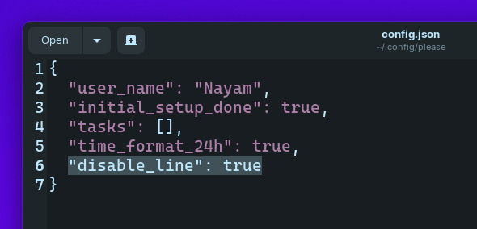

<h1 align="center">🙏 Please - New Tab Page for your Terminal 🙏</h1>

<h4 align="center">Get a beautifully formatted minimalistic new tab page with a greeting, date and time, inspirational quotes, your personal tasks and to-do list everytime you open the terminal.</h4>

<p align="center"></img></center>

## 📖 Table of Contents

- [🚀 Installation](#installation)

# Installation

### Method 1:

1. Make sure you have Python 3 installed on your computer.
2. Open your terminal and paste the command below:

   ```bash
   pip install please-cli

   # If you get an error about 'pip not found', just replace pip with pip3.
   ```

3. To run **please** everytime you open the terminal:

   ```bash
   # FOR BASH
   echo 'please' >> ~/.bashrc

   # FOR ZSH
   echo 'please' >> ~/.zshrc
   ```

4. That's it! Check if `please` command works in your terminal.

### Method 2:

1. Go to the releases section.
2. Download the latest release WHL file.
3. Open terminal and paste the command below:

   ```bash
   pip install --user ~/Downloads/please_cli*

   # If you get an error about 'pip not found', just replace pip with pip3.
   ```

   Change the path of the file if you downloaded it elsewhere.

4. To run **please** everytime you open the terminal:

   ```bash
   # FOR BASH
   echo 'please' >> ~/.bashrc

   # FOR ZSH
   echo 'please' >> ~/.zshrc
   ```

5. That's it! Check if `please` command works in your terminal.

###### Having trouble with installation or have any ideas? Please create an issue ticket :)

# Troubleshooting

Getting a `command not found: please` error? That means the Python modules installation folder is not in PATH.
To fix this:

```bash
echo 'export PATH="$PATH:$HOME/.local/bin"' >> ~/.profile
```

# Commands

```bash
# Show time, quotes and tasks
please

# Add a task
please add "TASK NAME"

# Delete a task
please delete <TASK NUMBER>

# Mark task as done
please do <TASK NUMBER>

# Mark task as undone
please undo <TASK NUMBER>

# Show tasks even if all tasks are markded as done
please showtasks

# Move task to specified position
please move <TASK NUMBER 1> <TASK NUMBER 2>

# Toggle Time between 24 hours and 12 hours format
please changetimeformat

# Change your name
please callme "NAME"

# Delete all done tasks
please clean

# Reset all settings and tasks
please setup
```

# Additional Optional Configuration

## Remove Horizontal Line in please's output

1.Navigate to `~/.config/please`  
2. Open config.json  
3. Add `"diable_line": true` at the end (don't forget to add a `,` at the end of the previous line)\


# Local Development

1. To get started, first install poetry:

```bash
curl -sSL https://raw.githubusercontent.com/python-poetry/poetry/master/get-poetry.py | python -
```

2. Clone this project
3. `cd` to the project directory and run virtual environment:

```bash
poetry shell

# OR THIS, IF 'poetry shell' doesn't work

. "$(dirname $(poetry run which python))/activate"
```

4. Install all dependencies:

```bash
poetry install
```

- `please` will be available to use as a command in the virtual environment after using `poetry install`.

5. Finally, run the python script with:

```bash
python please/please.py
```

6. To build a WHL package:

```bash
poetry build
```

- The package will be generated in **dist** folder, you can then use pip to install the WHL file.

# Uninstalling

Open your terminal and type:

```bash
pip uninstall please-cli
```

and also edit your **.zshrc** or **.bashrc** file and remove the line that says `please` at the end of the file.

#

# Credits

- Thanks to @CodePleaseRun & @guedesfelipe for their contributions.
- Thanks to @lukePeavey for the quotes.json file taken from quotable.io

#### Made by TGS963 and NayamAmarshe with ⌨ and 🖱
